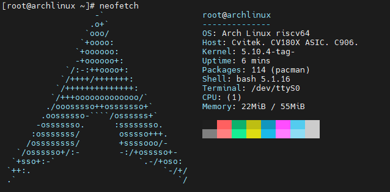
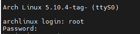

# Milkv-duo 运行 Arch Linux 系统

先上图：



通过更换 rootfs，可以实现 milkv-duo 上运行 arch linux riscv 系统。

> 以下相关编译工作在 Ubuntu 中完成，串口连接使用 Windows 下的 MobaXterm。

# 1. 编译

## 修改kernel配置

首先配置修改 kernel config 添加相关所需要的功能（主要是为了满足 `systemd` 的各种依赖）：

路径：`build/boards/cv180x/cv1800b_milkv_duo_sd/linux/cvitek_cv1800b_milkv_duo_sd_defconfig`：
```diff
diff --git a/build/boards/cv180x/cv1800b_milkv_duo_sd/linux/cvitek_cv1800b_milkv_duo_sd_defconfig b/build/boards/cv180x/cv1800b_milkv_duo_sd/linux/cvitek_cv1800b_milkv_duo_sd_defconfig
index 6c05a05df..d214f4fe0 100644
--- a/build/boards/cv180x/cv1800b_milkv_duo_sd/linux/cvitek_cv1800b_milkv_duo_sd_defconfig
+++ b/build/boards/cv180x/cv1800b_milkv_duo_sd/linux/cvitek_cv1800b_milkv_duo_sd_defconfig
@@ -260,3 +260,23 @@ CONFIG_ADVISE_SYSCALLS=n
 CONFIG_SIGNALFD=n
 CONFIG_TIMERFD=n
 CONFIG_EPOLL=n
+
+# for arch linux
+CONFIG_CGROUPS=y
+CONFIG_CGROUP_FREEZER=y
+CONFIG_CGROUP_PIDS=y
+CONFIG_CGROUP_DEVICE=y
+CONFIG_CPUSETS=y
+CONFIG_PROC_PID_CPUSET=y
+CONFIG_CGROUP_CPUACCT=y
+CONFIG_PAGE_COUNTER=y
+CONFIG_MEMCG=y
+CONFIG_CGROUP_SCHED=y
+CONFIG_NAMESPACES=y
+CONFIG_OVERLAY_FS=y
+CONFIG_AUTOFS4_FS=y
+CONFIG_SIGNALFD=y
+CONFIG_TIMERFD=y
+CONFIG_EPOLL=y
+CONFIG_IPV6=y
+CONFIG_FANOTIFY
```

## 其他配置修改

增大内存以及 `rootfs`分区的大小（待会使用的 Arch Linux 的根文件系统较大，默认大小可能容纳不下）：

```diff
diff --git a/build/boards/cv180x/cv1800b_milkv_duo_sd/memmap.py b/build/boards/cv180x/cv1800b_milkv_duo_sd/memmap.py
index 84161267a..99d640134 100644
--- a/build/boards/cv180x/cv1800b_milkv_duo_sd/memmap.py
+++ b/build/boards/cv180x/cv1800b_milkv_duo_sd/memmap.py
@@ -40,7 +40,7 @@ class MemoryMap:
     # =================
     # Multimedia buffer. Used by u-boot/kernel/FreeRTOS
     # =================
-    ION_SIZE = 26.80078125 * SIZE_1M
+    ION_SIZE = 0 * SIZE_1M
     H26X_BITSTREAM_SIZE = 0 * SIZE_1M
     H26X_ENC_BUFF_SIZE = 0
     ISP_MEM_BASE_SIZE = 0 * SIZE_1M
diff --git a/milkv/genimage-milkv-duo.cfg b/milkv/genimage-milkv-duo.cfg
index 40a95c7fb..ef89f3d79 100644
--- a/milkv/genimage-milkv-duo.cfg
+++ b/milkv/genimage-milkv-duo.cfg
@@ -13,7 +13,7 @@ image rootfs.ext4 {
 	ext4 {
 		label = "rootfs"
 	}
-	size = 256M
+	size = 1G
 }
 
 image milkv-duo.img {
```

## 开始编译

直接使用官方命令编译：
```bash
cd duo-buildroot-sdk/
./build_milkv.sh
```
或
```bash
export MILKV_BOARD=milkv-duo
source milkv/boardconfig-milkv-duo.sh

source build/milkvsetup.sh
defconfig cv1800b_milkv_duo_sd
clean_all
build_all
pack_sd_image
```

# 2. 修改根文件系统

## 导入 Arch Linux 根文件系统

先从 [Arch Linux RISC-V项目](https://archriscv.felixc.at/) 下载根文件系统：
```bash
cd 某个地方
wget https://archriscv.felixc.at/images/archriscv-2023-07-10.tar.zst
```

然后挂载之前编译出来的 `img` 镜像进行修改：

1. 寻找 `loop` 设备：
```bash
sudo losetup -f
```
我这边输出的是`/dev/loop18`，后续需要将这个数字根据实际情况修改

2. 将 `img` 镜像与 `loop` 设备绑定：
```bash
sudo losetup -P loop18 /path/to/duo-buildroot-sdk/install/soc_cv1800b_milkv_duo_sd/milkv-duo.img
```

3. 挂载 `rootfs` 分区
```bash
sudo mkdir /mnt/duo-rootfs
cd /mnt/duo-rootfs
```

删除原本的内容
```
sudo rm -rf ./*
```

将 `arch linux` 的根文件系统解压到此
```bash
tar -xvf /path/to/archriscv-2023-07-10.tar.zst -C .
```

## 下载需要的包

可以从 https://mirror.iscas.ac.cn/archriscv/repo 来下载需要的包

由于更换根文件系统之后官方的 `ko`、`sh` 脚本等文件都没有了（可以从之前的根文件系统中拷过来，但是可能会缺少依赖，需要大家后续来解决），板上可能没有网络，且还无法使用`rndis`，这边建议先安装 `rz`、`sz` 命令来用于串口传输文件

```bash
cd /mnt/duo-rootfs/root
wget https://mirror.iscas.ac.cn/archriscv/repo/extra/lrzsz-0.12.20-8-riscv64.pkg.tar.zst
```

> 当然，解决了开发板网络问题的朋友们可以直接使用 `pacman` 来安装应用

## 烧入 tf 卡

当下载拷贝工作都完成之后，可以先取消挂载 `img` 镜像：

```bash
sudo umount /dev/loop18p2
sudo losetup -d /dev/loop18
```

然后就可以将 `img` 镜像烧入 tf 卡中了

# 3. 插电 开机

开机并通过串口连接到开发板，如一切顺利，就可以看到登录界面了

开机并通过串口连接到开发板，如一切顺利，大概 40s 之后就可以看到登录界面了



默认账号：root
默认密码：archriscv

登录成功后 `ls` 一下，就能看到之前下载的 `lrzsz` 包了，先将其安装：
```bash
pacman -U ./lrzsz-0.12.20-8-riscv64.pkg.tar.zst
```

安装成功后，就可以使用 `rz` 命令传输文件了：
1. 输入 `rz` ，shell 中会提示 `waiting to receive`
2. 在 mobaxterm 中按 `ctrl` + 鼠标右键，选择 `Send file using Z-moderm`，然后选择想要上传的文件，这边选择了提前下载好的 `neofetch-7.1.0-2-any.pkg.tar.zst` 包
3. 等待传输完毕

> 注意：本人在使用 `rz` 命令传输大文件的时候发生了开发板卡死的现象，大家尽量避免传输大文件

使用 `pacman` 安装 `neofetch` ，运行，就能看到文章开头图片的界面啦


本人水平有限，欢迎各位指出问题 :handshake:，大家一起来折腾 :sunglasses: