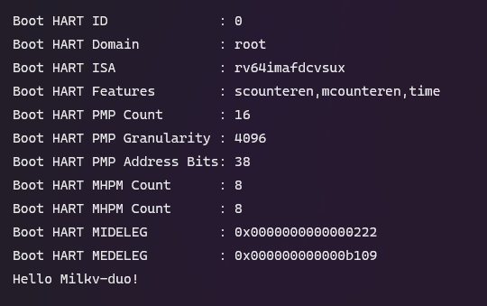

# 使用 Opensbi 引导自己的 bl33

之前在 [使用uboot引导自己的操作系统](./uboot-boot-os.md) 中尝试了使用 opensbi 来引导自己的操作系统，但是当时发现无论是制作 fip 时还是 ATF 启动时都对 bl33 的镜像有格式要求。

这段时间学习了下 riscv 的汇编和链接脚本，然后重新看了下 ATF 和 uboot 的代码，发现制作自己的 bl33 镜像其实很简单，只要在程序的最开始处加入以下信息即可：

```
_start:
	/* BL33 information */
	j real_start
	.balign 4
	.word 0x33334c42  /* b'BL33' */
	.word 0xdeadbeea  /* CKSUM */
	.word 0xdeadbeeb  /* SIZE */
	.quad 0x80200000  /* RUNADDR */
	.word 0xdeadbeec
	.balign 4
	j real_start
	.balign 4
	/* BL33 end */
```

**以下是一个简单的例子：**

若没有编译过 sdk 的话需要先编译下 fsbl 来获得 bl2 镜像：

```bash
export MILKV_BOARD=milkv-duo
source milkv/boardconfig-milkv-duo.sh

source build/milkvsetup.sh
defconfig cv1800b_milkv_duo_sd

build_fsbl
```

然后编写一个简单的程序，使用 uart8250 来打印一句字符串：

```
#define UART0_THR 0x04140000
#define UART0_LSR 0x04140014

	.section .text
	.global _start
_start:
	/* BL33 information */
	j real_start
	.balign 4
	.word 0x33334c42  /* b'BL33' */
	.word 0xdeadbeea  /* CKSUM */
	.word 0xdeadbeeb  /* SIZE */
	.quad 0x80200000  /* RUNADDR */
	.word 0xdeadbeec
	.balign 4
	j real_start
	.balign 4
	/* Information end */

real_start:
	la s0, str
1:
	lbu a0, (s0)
	beqz a0, exit
	jal ra, uart_send
	addi s0, s0, 1
	j 1b

exit:
	j exit

uart_send:
	/* Wait for tx idle */
	li t0, UART0_LSR
	lw t1, (t0)
	andi t1, t1, 0x20
	beqz t1, uart_send
	/* Send a char */
	li t0, UART0_THR
	sw a0, (t0)
	ret

.section .rodata
str: 
	.asciz "Hello Milkv-duo!\n"
```

编译：

```bash
riscv64-unknown-elf-gcc -nostdlib -fno-builtin -march=rv64gc -mabi=lp64f -g -Wall -Ttext=0x80200000 -o bl33.elf start.S

riscv64-unknown-elf-objcopy -O binary bl33.elf bl33.bin
```

此时可以用 `hd` 看一下生成的 `bin` 文件，会发现已经存在了用于校验的两行数据，而 opensbi 实际会跳转到 `0x80200020` 来执行我们的程序。

```
00000000  05 a0 01 00 42 4c 33 33  ea be ad de eb be ad de  |....BL33........|
00000010  00 00 20 80 00 00 00 00  ec be ad de 11 a0 01 00  |.. .............|
```

进入到 `fsbl` 目录生成 `fip.bin` 文件：

```bash
cd fsbl/

./plat/cv180x/fiptool.py -v genfip \
    'build/cv1800b_milkv_duo_sd/fip.bin' \
    --MONITOR_RUNADDR="0x0000000080000000" \
    --CHIP_CONF='build/cv1800b_milkv_duo_sd/chip_conf.bin' \
    --NOR_INFO='FFFFFFFFFFFFFFFFFFFFFFFFFFFFFFFFFFFFFFFFFFFFFFFFFFFFFFFFFFFFFFFFFFFFFFFF' \
    --NAND_INFO='00000000'\
    --BL2='build/cv1800b_milkv_duo_sd/bl2.bin' \
    --DDR_PARAM='test/cv181x/ddr_param.bin' \
    --MONITOR='../opensbi/build/platform/generic/firmware/fw_dynamic.bin' \
    --LOADER_2ND='/home/jude/Code/duo/bl33/bl33.bin' \
    --compress='lzma'
```


最后将 `fip.bin` 文件放到 tf 卡，使用 `128000` 比特率连接到板子的串口，就能看到我们的打印信息了：

