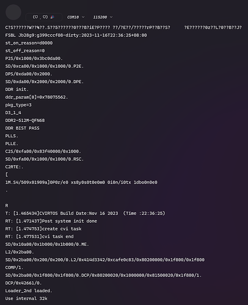

# Set the baud rate to 115200 before uboot

在 Duo 的启动过程中，在 atf 和 opensbi 阶段（包括小核里运行的 FreeRTOS）波特率都为 128000，而在 uboot 启动之后包括在 linux 中，波特率又变成了 115200。查看了文档及代码，发现原因出现在波特率的计算过程中。计算得到的波特率分频系数为 `13.56`，这个数字应该要四舍五入，但在 uboot 之前的 uart 驱动中，只是把它的小数舍去了，导致波特率被设置成了 128000。

During the startup of Duo, the baud rate is 128000 in both the atf and opensbi (including FreeRTOS running in the second core), and after the uboot startup, including linux, the baud rate turns to 115200. After reading the doc and code I found that It was a miscalculation of the baud rate. The calculated baud rate frequency division factor is `13.56`, this number should be rounded, but in the uart driver before uboot, it is only rounded off the decimal, resulting in the baud rate is set to 128000.

要更改 uboot 之前的波特率，需要在 bl2 和 opensbi 中进行设置，在 bl2 中我们在 `bl2_main()`函数的最开始处进行设置：

To change the baud rate before uboot, it needs to be set in bl2 and opensbi. In bl2 we set this at the beginning of the `bl2_main()` function:
```c
// duo-buildroot-sdk/fsbl/plat/cv180x/bl2/bl2_main.c

#if !FSBL_SECURE_BOOT_SUPPORT
int dec_verify_image(const void *image, size_t size, size_t dec_skip, struct fip_param1 *fip_param1)
{
	return 0;
}
#endif

// Start of addition
#define UART_DLL 0x04140000
#define UART_DLH 0x04140004
#define UART_LCR 0x0414000C

void set_baudrate()
{
	// 14 for 115200, 13 for 128000
	int baud_divisor = 14;

	// set DLAB to 1 to set dll and dlh
	*(volatile uint32_t*)(UART_LCR) |= (uint32_t)0x80;

	// set divisor
	*(volatile uint32_t*)(UART_DLL) = (uint32_t)(baud_divisor & 0xff);
	*(volatile uint32_t*)(UART_DLH) = (uint32_t)((baud_divisor >> 8) & 0xff);

	// set DLAB back to 0
	*(volatile uint32_t*)(UART_LCR) &= (uint32_t)(~0x80);
}
// End of addition

void bl2_main(void)
{
	// Start of addition
	set_baudrate();
	// End of addition

	ATF_STATE = ATF_STATE_BL2_MAIN;
	time_records->fsbl_start = read_time

// ...
```

我查看了 opensbi 的主线代码，发现主线中这个 bug 已经被修复了，我们只需要跟着主线进行更改：

Reading the mainline code of opensbi and I found that the bug in the mainline has been fixed, we only just to follow the mainline to make changes:
```c
// duo-buildroot-sdk/opensbi/lib/utils/serial/uart8250.c

int uart8250_init(unsigned long base, u32 in_freq, u32 baudrate, u32 reg_shift,
		  u32 reg_width)
{
	u16 bdiv;

	uart8250_base      = (volatile void *)base;
	uart8250_reg_shift = reg_shift;
	uart8250_reg_width = reg_width;
	uart8250_in_freq   = in_freq;
	uart8250_baudrate  = baudrate;

	// Start of modification
	bdiv = (uart8250_in_freq + 8 * uart8250_baudrate) /
		(16 * uart8250_baudrate);
	// End of modification

	/* Disable all interrupts */
	set_reg(UART_IER_OFFSET, 0x00);
	/* Enable DLAB */
	set_reg(UART_LCR_OFFSET, 0x80);
```

然后重新编译 fsbl：

Then recompile fsbl:
```shell
cd /path/to/duo-buildroot-sdk

export MILKV_BOARD=milkv-duo
source milkv/boardconfig-milkv-duo.sh
source build/milkvsetup.sh
defconfig cv1800b_milkv_duo_sd

build_fsbl

ls fsbl/build/cv1800b_milkv_duo_sd/fip.bin
```

将 `fip.bin` 拷贝到 tf 卡的第一个分区，上电，就可以用 115200 波特率观察输出了。

Copy `fip.bin` to the first partition of the tf card, power on. And we can use 115200 baud rate to observe the output.

