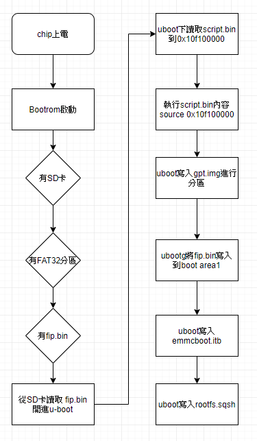
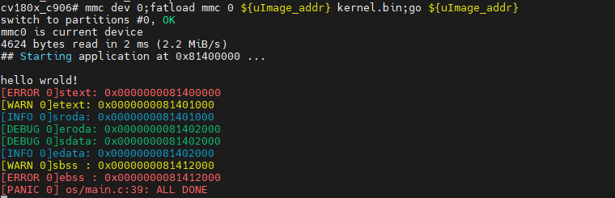

# 使用uboot引导自己的操作系统

> 更新：
>
> 从之前的repo仓库换成整个的git仓库之后，文件路径不同了
>
> 需要修改的uboot config文件为：`duo-buildroot-sdk/build/boards/cv180x/cv1800b_milkv_duo_sd/u-boot/cvitek_cv1800b_milkv_duo_sd_defconfig`
>
> 编译出来的文件路径是：`duo-buildroot-sdk/install/soc_cv1800b_milkv_duo_sd/fip.bin`

根据芯片的官方文档，CV1800b 在启动时会在 FAT32 分区中寻找 `fip.bin` 文件，引导其中的 `bl2->opensbi->uboot`，uboot 再去引导 `boot.sd`。



最开始我想的是将自己的 kernel 替换 uboot（即放在 LOADER_2ND 的位置），直接从 opensbi 跳转进来，但在编译 `fip.bin` 的过程中发现 ，LOADER_2ND 需要满足 BL33 的相关要求，即使强行删掉 BL33 的相关校验得到 `fip.bin` 镜像，在板子启动时还是会报 lzma 编解码的相关错误。由于板子的 Bootrom 与 BL2 都未开源，加上自己也不是特别了解，遂放弃这个方法。

后来看到了[开始裸奔吧,少年](https://bbs.aw-ol.com/topic/132/share/1)这篇文章，了解了可以使用 uboot 来引导自己的操作系统。

先了解下 uboot 的引导流程：
- 首先把 tf 卡中的 boot 分区中只保留 `fip.bin` 文件，这样在启动时 uboot 会找不到 `boot.sd` 文件而停止（uboot 默认的等待时间只有一秒，太快了我按不过来）。
- uboot 命令行中使用 `printenv` 查看环境变量：
```shell
cv180x_c906# printenv
...
bootargs=root=/dev/mmcblk0p2 rootwait rw console=ttyS0,115200 earlycon=sbi loglevel=9 riscv.fwsz=0x80000
bootcmd=run sdboot
...
sdboot=setenv bootargs ${root} ${mtdparts} console=$consoledev,$baudrate $othbootargs;echo Boot from SD ...;mmc dev 0 && fatload mmc 0 ${uImage_addr} boot.sd; if test $? -eq 0; then bootm ${uImage_addr}#config-cv1800b_sophpi_duo_sd;fi;
...
```
- 可以看到，uboot 做的事情就是把 `boot.sd` 加载到 `${uImage_addr}` 的位置，再跳转到 `${uImage_addr}` 继续运行。

根据上面这篇文章，`bootm` 是引导 linux kernel 的，包含了引导协议的一些东西，我们作为一个裸机程序，我们可以使用 uboot 的 `go` 命令直接跳转，我们需要在 uboot 的 defconfig 中打开 `go` 命令的配置。（不知道 rls_defconfig 有什么用，干脆一起改了）

```diff
diff --git a/boards/cv180x/cv1800b_sophpi_duo_sd/u-boot/cvitek_cv1800b_sophpi_duo_sd_defconfig b/boards/cv180x/cv1800b_sophpi_duo_sd/u-boot/cvitek_cv1800b_sophpi_duo_sd_defconfig
index 1bb7fde..e821fcb 100644
--- a/boards/cv180x/cv1800b_sophpi_duo_sd/u-boot/cvitek_cv1800b_sophpi_duo_sd_defconfig
+++ b/boards/cv180x/cv1800b_sophpi_duo_sd/u-boot/cvitek_cv1800b_sophpi_duo_sd_defconfig
@@ -32,7 +32,7 @@ CONFIG_BOOTM_OPENRTOS=y
 # CONFIG_BOOTM_VXWORKS is not set
 # CONFIG_CMD_ELF is not set
 # CONFIG_CMD_FDT is not set
-# CONFIG_CMD_GO is not set
+CONFIG_CMD_GO=y
 # CONFIG_CMD_IMI is not set
 # CONFIG_CMD_XIMG is not set
 # CONFIG_CMD_EXPORTENV is not set
diff --git a/boards/cv180x/cv1800b_sophpi_duo_sd/u-boot/cvitek_cv1800b_sophpi_duo_sd_rls_defconfig b/boards/cv180x/cv1800b_sophpi_duo_sd/u-boot/cvitek_cv1800b_sophpi_duo_sd_rls_defconfig
index b4250f2..4419c0c 100644
--- a/boards/cv180x/cv1800b_sophpi_duo_sd/u-boot/cvitek_cv1800b_sophpi_duo_sd_rls_defconfig
+++ b/boards/cv180x/cv1800b_sophpi_duo_sd/u-boot/cvitek_cv1800b_sophpi_duo_sd_rls_defconfig
@@ -32,7 +32,7 @@ CONFIG_BOOTM_OPENRTOS=y
# CONFIG_BOOTM_VXWORKS is not set
# CONFIG_CMD_ELF is not set
# CONFIG_CMD_FDT is not set
-# CONFIG_CMD_GO is not set
+CONFIG_CMD_GO=y
# CONFIG_CMD_IMI is not set
# CONFIG_CMD_XIMG is not set
# CONFIG_CMD_EXPORTENV is not set
```

修改完成后重新编译 `fip.bin`：
```bash
source build/cvisetup.sh
defconfig cv1800b_sophpi_duo_sd
clean_all
build_fsbl
```

将编译出来的 `install/soc_cv1800b_sophpi_duo_sd/fip.bin` 文件与自己的 `kernel.bin` 文件放入 tf卡的 boot 分区中，启动后在 uboot 命令行中输入命令跳转到 kernel 中：
```bash
mmc dev 0;fatload mmc 0 ${uImage_addr} kernel.bin;go ${uImage_addr}
```

引导成功：




如果想 uboot 在启动时就直接引导自己的 kernel，可以在`u-boot-2021.10/include/configs/cv180x-asic.h`中修改 bootcommand：
```diff
diff --git a/include/configs/cv180x-asic.h b/include/configs/cv180x-asic.h
index 08b70193..f1cfc95e 100644
--- a/include/configs/cv180x-asic.h
+++ b/include/configs/cv180x-asic.h
@@ -283,12 +283,9 @@
                    "console=$consoledev,$baudrate $othbootargs;"

    #define SD_BOOTM_COMMAND \
-               SET_BOOTARGS \
                "echo Boot from SD ...;" \
-               "mmc dev 0 && fatload mmc 0 ${uImage_addr} boot.sd; " \
-               "if test $? -eq 0; then " \
-               UBOOT_VBOOT_BOOTM_COMMAND \
-               "fi;"
+               "mmc dev 0 && fatload mmc 0 ${uImage_addr} kernel.bin; " \
+               "go ${uImage_addr}"

    #ifndef CONFIG_SD_BOOT
        #define CONFIG_BOOTCOMMAND  SHOWLOGOCMD "cvi_update || run norboot || run nandboot ||run emmcboot"
```

参考资料：https://bbs.aw-ol.com/topic/132/share/1